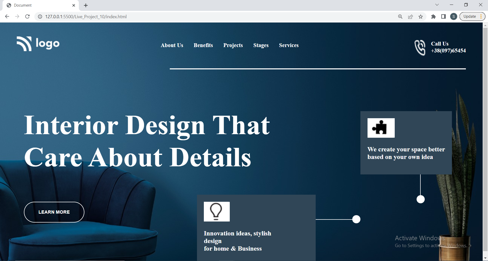
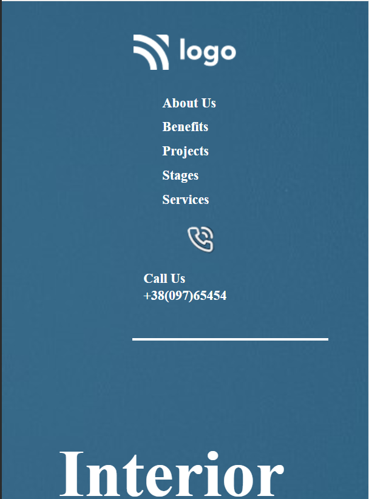

# Interior Design Website []

This is basically a one pager website Template project made in HTML/CSS for an imaginary home designer on the internet.
Hope you like my project !! it works good in laptop screen if you are using desktop please zoom in or out that might work .

## Technologies Used
  - HTML
  - CSS
  - CSS Flex box

## Demo
### Laptop View


### Mobile Screen View


Clone the project

```bash
  git clone https://github.com/suhas-sm/Interior-Design.git
```

Go to the project directory

```bash
  cd Interior-Design
```
## Features

- Transition Scroll Effect
- Modern Typical webpage design
- UI/UX Design
- Full Blown Website
- Mobile Responsive

## What i have learnt By working on this project
1. I have improved my self in positioning of images in a spesific position, also using flex properties
2. Improved in designing the project
3. Making it responsivness in better way
4. Had a hands on practise on z-index, opacity, border and absolute positioning

## Honest Time to finish the project

I had took about 2 hours. This project made me understand how to make an image positioned with respect to other and also using flex properties.

## Feedback

If you have any feedback, please reach out to us at melmurissm11@gmail.com
